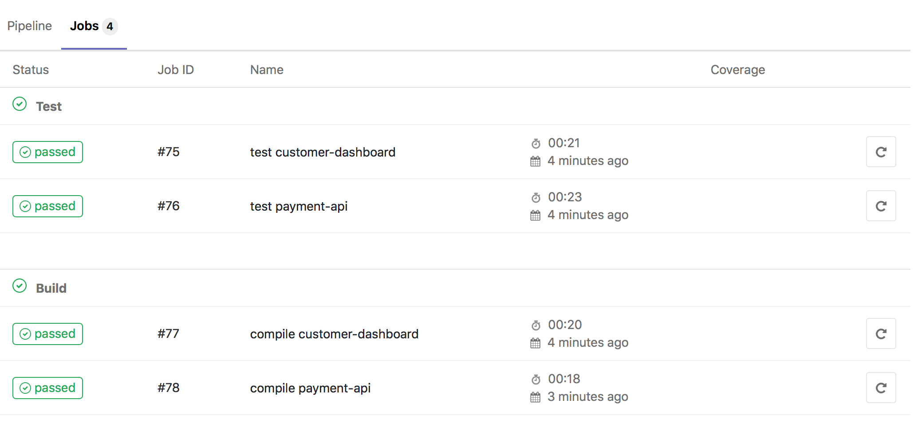
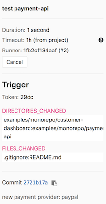

Walkthrough and examples on how GitLab 10.7+ and 11.0+ help managing CI when using **monorepos**.

## The problem

As of right now it is only possible to have at most one `.gitlab-ci.yml` file per repository. However multiple projects / codebases are housed in one repo when using monorepos which makes it more difficult to use with GitLab CI.

I will show **2 approaches** that tackle this issue.  
Both are based on [variable expressions](https://docs.gitlab.com/ce/ci/variables/README.html#variables-expressions) introduced in GitLab 10.7 (released in late April 2018) that allow you to evaluate variables in `only` and `except` policies.

## Approach 1: Use git commit message to explicitly tell which CI jobs to run
GitLab 11.0 (scheduled to release on June 22nd) makes it possible to [use regex](https://docs.gitlab.com/ce/ci/variables/README.html#supported-syntax) in these variable expressions. Let's look at an example of how to leverage this with monorepos:

In [examples/monorepo](./examples/monorepo) you will find 3 sub-directories. Each one represents a separate codebase in a monorepo. Now let's look at the [.gitlab-ci.yml](./examples/monorepo/.gitlab-ci.yml). The interesting section is the project/codebase-specific configuration:

```
.payment-api: &payment-api
  variables:
    PROJECT_NAME: payment-api
  only:
    variables:
      - $CI_COMMIT_MESSAGE =~ /\[ci job:.*payment-api.*\]/i
      - $RUN_JOBS_ALL == "true"
      - $RUN_JOBS_PAYMENT_API == "true"
```

We define a [hidden CI job](https://docs.gitlab.com/ce/ci/yaml/README.html#hidden-keys-jobs) to use for templating with [YAML anchors](https://docs.gitlab.com/re/ci/yaml/README.html#anchors) and we set project-specific variables that are used in the actual CI jobs, like the project name.  
Now the **most important part**: The `only` policy defines that there are 3 cases when to run this job.

First and foremost:  
**If the commit message matches a regex that tells us to run the CI jobs for the payment-api codebase.**

Such a commit message could read like this:

```
commit 63e93c0108e5da238d47a20d242c2445922b7204 (local/staging, staging)
Author: John Doe <john@example.com>
Date:   Thu May 24 13:01:25 2018 +0200

    new payment provider: paypal

    - refactored checkout system
    - implemented paypal provider

    [ci job: payment-api customer-dashboard]
```

This will trigger payment-api and customer-dashboard related jobs **only**:



When you want to explicitly run the pipeline (e.g. via GitLab web dashboard) for one or more specific codebases, you can set `RUN_JOBS_<CODEBASE_NAME>` to true. If you want to run CI jobs for all codebases, set `RUN_JOBS_ALL` to true. If we do not include these two options here, it will not be possible to (re-)run a pipeline because the commit message regex will never match.

**Attention**: If you use this approach and push multiple commits to a branch at once, it will only run the jobs specified in the most recent commit message!

As of writing this GitLab 11.0 is not released yet, however you can use the official [Docker image](https://hub.docker.com/r/gitlab/gitlab-ce/tags/) to run a RC or nightly build. The Gitlab runner may have version 10.X when trying this out.

## Approach 2: Determine programmatically which jobs need to run and then trigger CI builds via API with variables

If you don't want to go the git commit message route, we will need to use another way of setting variables dynamically which decide which CI jobs run.

It is possible to trigger a pipeline via API and passing [variables](https://docs.gitlab.com/ce/ci/triggers/README.html#pass-job-variables-to-a-trigger) along. This gives you a lot of flexibility processing which variables to set.

For monorepos it is important to know/determine which files changed. If only files in the payment-api codebase changed, we only need to run the CI jobs associated with this project.

If you are not already triggering your builds via API and instead want to continue to use the "traditional" CI triggering mechanism your GitLab CI flow will currently look something like this:

```
git push
==> pipeline gets triggered implicitly by GitLab
==> GitLab evaluates CI file and starts pipeline
==> CI pipeline runs
```

One approach to preserve this while also adding file change detection for monorepos, we will need to add a custom component (let's call it `gitlab-trigger-proxy`), which acts as an endpoint to a [GitLab webhook](https://docs.gitlab.com/ce/user/project/integrations/webhooks.html) and will then trigger the pipeline explicitly via API, so our flow now looks like:

```
git push
==> GitLab Webhook gets triggered
==> Push event payload including which files changed is sent to gitlab-trigger-proxy endpoint
==> gitlab-trigger-proxy parses which paths (files/directories) changed and sets variables accordingly
==> Trigger pipeline via API including trigger variables
==> GitLab evaluates CI file and starts pipeline
==> CI pipeline runs
```

I wrote a sample implementation in Go (~250 LOC), but the process is pretty straight forward so you can (re)-write this in any language you want. It is also easy to extend the current implementation.

### Quickstart gitlab-trigger-proxy

1. Install it

If you have Go installed:

```
$ go get github.com/BastiPaeltz/gitlab-ci-monorepo/gitlab-trigger-proxy
$ $GOPATH/bin/gitlab-trigger-proxy --help

Usage of gitlab-trigger-proxy:
  -directory value
    	A directory to track for change. Can be set multiple times.
  -file value
    	A file to track for change. Can be set multiple times.
  -gitlab-host string
    	You can set the GitLab host manually. By default the host will be parsed from the projects web URL.
  -listen string
    	Listen address (default ":8080")
  -secret-token string
    	GitLab webhook secret token.
  -separator string
    	Choose what separates paths in trigger variables value. (default ":")
  -trigger-token string
    	REQUIRED - GitLab pipeline trigger token. (default "REQUIRED")
```

You can also use Docker:

```
docker run bastipaeltz/gitlab-trigger-proxy
```

Otherwise you can use a binary for your platform from the GitHub releases page.

2. Set up your GitLab project

Go to `settings/ci_cd` in your project, scroll down to `Pipeline triggers` and create a token. I will use "mytriggertoken" in the example below.  
Create a webhook to send push events to gitlab-trigger-proxy under `settings/integrations`. It is recommended to also specify a secret token. I will use "mysecrettoken" in the example below.

3. Run gitlab-trigger-proxy

Here is how to run gitlab-trigger-proxy for the monorepo example:

```
gitlab-trigger-proxy --trigger-token=mytriggertoken --secret-token=mysecrettoken --directory="examples/monorepo/accounting-service" --directory="examples/monorepo/customer-dashboard" --directory="examples/monorepo/payment-api" --file=".gitlab-ci.yml"
```

This will listen on port 8080 for GitLab webhooks and track changes for all projects root directories as well as the `.gitlab-ci.yml` file because we probably want to trigger a build if it changes.

4. Adjust .gitlab-ci.yml

The CI variables set by gitlab-trigger-proxy are `DIRECTORIES_CHANGED` and `FILES_CHANGED`. All paths are separated by ":" (you can change the separator with `--separator`). You can inspect them at the at the right side of the Gitlab CI jobs dashboard page:



Now we can adjust the CI jobs section to trigger `only` if a certain directory or file changed:

```
.customer-dashboard: &customer-dashboard
  variables:
    PROJECT_NAME: customer-dashboard
  only:
    variables:
      - $DIRECTORIES_CHANGED =~ /customer-dashboard/
      - $FILES_CHANGED =~ /\.gitlab-ci/
      - $RUN_JOBS_ALL == "true"
      - $RUN_JOBS_CUSTOMER_DASHBOARD == "true"
```

This will run the customer-dashboard job whenever a directory with that name changes or when the CI file changes. We also add the other two options to again be able to (re)-run a pipeline manually.

5. Now you can just push as usual to your repository and gitlab-trigger-proxy will make sure only the relevant jobs are triggered in your pipeline.